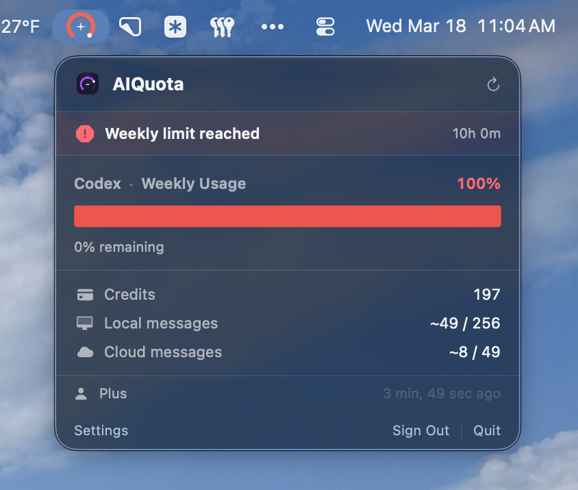

# AIQuota

A native macOS menubar utility to monitor your [OpenAI Codex](https://openai.com/codex) weekly usage quota — at a glance, without opening a browser.




---

## Features

- **Menubar gauge icon** — color-coded arc gauge showing quota consumption at a glance:
  - ⚫ White — plenty of quota remaining (>15%)
  - 🟡 Amber — getting low (5–15%)
  - 🔴 Red — critical or limit reached (<5%)
- **Popover detail view** — click the icon to see weekly usage bar, Codex credits, estimated local/cloud messages, plan badge, and last-fetched timestamp
- **Limit reached banner** — prominent alert with reset countdown when your weekly cap is hit
- **Auto-refresh** — background polling with manual refresh button
- **WidgetKit widget** — small and medium desktop widgets that update alongside the app
- **Sign in with ChatGPT** — OAuth via browser session, tokens stored securely in Keychain

---

## Requirements

- macOS 26 (Tahoe) or later
- An OpenAI account with Codex access (Plus, Pro, or Team plan)

---

## Installation

1. Download `AIQuota.dmg` from the [latest release](https://github.com/niederme/ai-quota/releases/latest)
2. Open the DMG and drag **AIQuota** to your Applications folder
3. Launch AIQuota — it appears in your menu bar, not the Dock
4. Click the icon and sign in with your ChatGPT account

> Notarized by Apple — no Gatekeeper warning on first launch.

---

## Building from Source

Requires Xcode 26 beta and [XcodeGen](https://github.com/yonaskolb/XcodeGen).

```bash
git clone https://github.com/niederme/ai-quota.git
cd ai-quota
xcodegen generate
open AIQuota.xcodeproj
```

Build and run the `AIQuota` scheme.

---

## Project Structure

```
ai-quota/
├── Packages/
│   └── AIQuotaKit/          # Shared Swift Package (models, networking, storage)
│       └── Sources/AIQuotaKit/
│           ├── Models/      # CodexUsage, AuthToken, AppSettings
│           ├── Networking/  # OpenAIClient, AuthManager, NetworkError
│           └── Storage/     # KeychainStore, SharedDefaults
├── AIQuota/                 # Main app target (MenuBarExtra)
│   ├── Views/               # PopoverView, MenuBarIconView, SettingsView
│   └── ViewModels/          # QuotaViewModel
└── AIQuotaWidget/           # WidgetKit extension
    ├── Provider/            # QuotaTimelineProvider
    └── Views/               # WidgetSmallView, WidgetMediumView
```

---

## Roadmap

- [ ] Claude quota support (Anthropic Pro/Max plans)
- [ ] Gemini quota support (Google AI plans)
- [ ] Configurable default service shown in menu bar
- [ ] Notification when quota drops below threshold
- [ ] Check for Updates (with optional auto-check)

---

## License

MIT with [Commons Clause](https://commonsclause.com). Free to use, modify, and distribute — commercial or proprietary use is not permitted.
